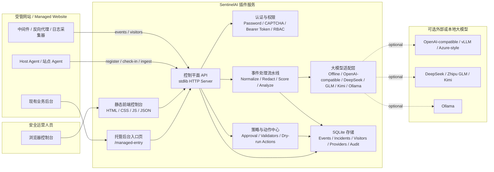
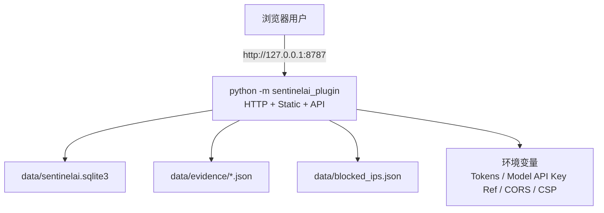
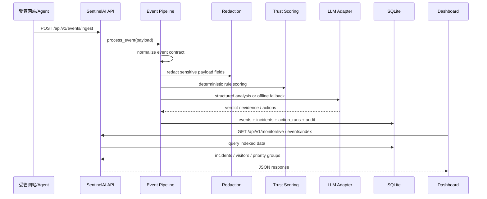
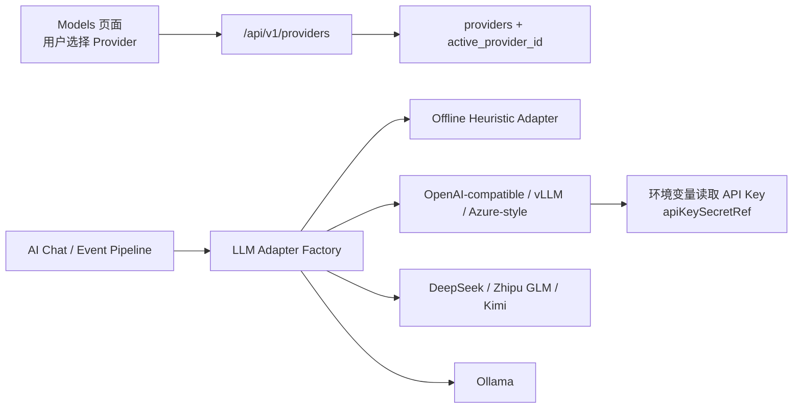
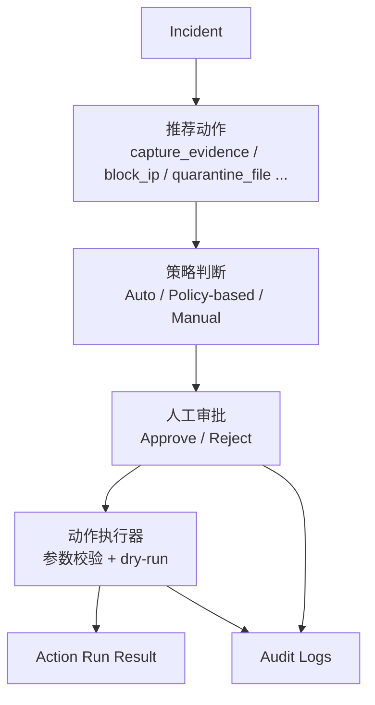

# SentinelAI Security Plugin - 系统总架构

版本日期：2026-05-07

## 1. 架构目标

SentinelAI Security Plugin 是一个可运行的 Web 安全监控插件产品 MVP。系统目标是把受管网站、插件控制台、事件分析、访客记录、AI 大模型接口、人工审批和审计日志整合到一个离线可运行、可嵌入现有后台、可逐步接入真实生产环境的安全控制平面中。

核心设计原则：

- 规则优先：安全评分、去重、优先级和动作审批由确定性规则驱动，大模型只负责辅助分析和解释。
- 默认安全：本地运行、SQLite 存储、敏感字段脱敏、同源 CORS、安全响应头、默认高危动作 dry-run。
- 可插拔接入：受管网站通过 HTTP API 上报事件、访客记录和 Agent 心跳；大模型通过 Provider Profile 自主选择。
- 中英双语：前端界面和 API 错误信息支持中文/英文展示。
- 可审计：登录、事件接入、模型配置、AI 对话、审批和动作执行均写入审计日志。

## 2. 总体逻辑架构



## 3. 运行时部署视图

当前 MVP 采用单进程部署：

- Python 标准库 HTTP Server 提供 API 和静态文件服务。
- SQLite 作为本地持久化数据库。
- `data/` 目录保存数据库、证据文件、阻断模拟记录等运行时数据。
- 前端不依赖外部 CDN，静态资源全部位于 `sentinelai_plugin/static/`。
- 默认监听 `127.0.0.1:8787`，可以通过命令行参数或环境变量调整。



推荐启动方式：

```powershell
python -m sentinelai_plugin --host 127.0.0.1 --port 8787 --db data\sentinelai.sqlite3 --data-dir data --demo
```

## 4. 主要模块职责

| 层级 | 文件 / 目录 | 职责 |
| --- | --- | --- |
| 前端控制台 | `sentinelai_plugin/static/index.html` | 登录、监控、事件、访客、内容、模型、AI 对话、账户和审计主界面 |
| 前端脚本 | `sentinelai_plugin/static/app.js` | API 调用、状态轮询、节点地图渲染、列表渲染、模型配置、AI 对话 |
| 前端样式 | `sentinelai_plugin/static/styles.css` | 仿参考图的暗色 HUD 地图风格、响应式布局、控件样式 |
| 地图配置 | `sentinelai_plugin/static/mission-map.json` | 监控节点标签、坐标、总数、连线配置 |
| 托管入口 | `sentinelai_plugin/static/managed-entry.html` / `managed-entry.js` | 现有网站后台可查看的插件摘要入口和跳转按钮 |
| HTTP API | `sentinelai_plugin/server.py` | 路由、认证、错误本地化、安全响应头、静态文件服务 |
| 配置 | `sentinelai_plugin/config.py` | 运行参数、环境变量、路径、Token、安全开关 |
| 认证 | `sentinelai_plugin/auth.py` | PBKDF2 密码、验证码、密码策略 |
| 事件流水线 | `sentinelai_plugin/pipeline.py` | 事件标准化、脱敏、评分、模型分析、事件与 Incident 入库 |
| 评分引擎 | `sentinelai_plugin/scoring.py` | SQL 注入、XSS、路径穿越、异常登录等规则评分 |
| 脱敏 | `sentinelai_plugin/redaction.py` | 密码、Token、Cookie、Authorization、Secret 等敏感字段替换 |
| 大模型适配 | `sentinelai_plugin/llm.py` | 离线分析器、OpenAI-compatible / vLLM / Azure-style、DeepSeek、GLM、Kimi、Ollama 适配 |
| 策略权限 | `sentinelai_plugin/policy.py` | RBAC、动作审批、角色能力边界 |
| 动作执行 | `sentinelai_plugin/actions.py` | 固定动作目录、参数校验、dry-run 或模拟执行 |
| 存储 | `sentinelai_plugin/storage.py` | SQLite schema、事件索引、访客去重、审计日志、Provider、Agent |
| Agent 模拟 | `sentinelai_plugin/agent.py` | Demo Agent 注册、心跳和事件上报 |
| 测试 | `tests/` | API 冒烟、评分、流水线单元测试 |

## 5. 前端架构

前端是单页式控制台，由本地 HTML、CSS、JavaScript 和 JSON 驱动。

主要视图：

- Monitor：实时监控数据、节点地图、关键指标、实时事件、访客流。
- Incidents：事件中心，展示事件详情、规则命中、分析结果和动作。
- Visitors：访客访问记录，重复访问只更新计数和最后访问时间。
- Content：事件内容索引，按时间/天分组，按优先级排序，展示攻击者输入。
- Models：大模型 Provider 配置、激活和健康状态。
- AI Chat：与当前连接的大模型进行前端对话，携带受管站点上下文。
- Account：管理员密码修改。
- Audit：审计日志。

前端数据刷新方式：

- 登录后调用 `/api/v1/status` 获取系统状态。
- 通过 `/api/v1/monitor/live` 获取实时监控快照。
- 轮询事件、访客、Provider、Agent、审计等接口刷新界面。
- 地图节点由 `mission-map.json` 控制，节点点击后切换对应模块。

## 6. 后端控制平面

后端由 `server.py` 中的标准库 HTTP 服务实现，承担以下职责：

- 静态资源服务：`/`、`/static/*`、`/managed-entry`。
- 认证入口：验证码、登录、密码修改。
- 监控数据读取：状态、实时快照、事件、Incident、访客、审计。
- 数据接入：事件上报、访客上报、Agent 注册和心跳。
- 模型管理：Provider 新增、修改、激活。
- AI 对话：读取历史消息、生成并保存模型回复。
- 人工决策：Incident approve/reject。
- 动作执行：执行固定动作目录中的已批准动作。

关键 API：

| API | 方法 | 用途 |
| --- | --- | --- |
| `/api/v1/status` | GET | 系统状态、计数、语言、模式 |
| `/api/v1/auth/captcha` | GET | 获取一次性验证码 |
| `/api/v1/auth/login` | POST | 密码 + CAPTCHA 登录 |
| `/api/v1/auth/change-password` | POST | 修改管理员密码 |
| `/api/v1/monitor/live` | GET | 实时监控数据聚合 |
| `/api/v1/events/ingest` | POST | 接收安全事件 |
| `/api/v1/events` | GET | 原始事件列表 |
| `/api/v1/events/index` | GET | 按天和优先级索引后的事件内容 |
| `/api/v1/incidents` | GET | Incident 列表 |
| `/api/v1/incidents/{id}` | GET | Incident 详情 |
| `/api/v1/incidents/{id}/approve` | POST | 人工批准 |
| `/api/v1/incidents/{id}/reject` | POST | 人工拒绝 |
| `/api/v1/action-runs/{id}/execute` | POST | 执行动作 |
| `/api/v1/visitors/record` | POST | 记录访客访问 |
| `/api/v1/visitors` | GET | 访客记录列表 |
| `/api/v1/providers` | GET/POST | 模型 Provider 列表和新增 |
| `/api/v1/providers/{id}` | PATCH | 更新 Provider |
| `/api/v1/providers/{id}/activate` | POST | 激活 Provider |
| `/api/v1/agents/register` | POST | Agent 注册 |
| `/api/v1/agents/check-in` | POST | Agent 心跳 |
| `/api/v1/agents` | GET | Agent 列表 |
| `/api/v1/ai/chat` | GET/POST | AI 对话历史和发送消息 |
| `/api/v1/managed-site/summary` | GET | 托管网站后台摘要 |
| `/api/v1/audit-logs` | GET | 审计日志 |

## 7. 核心数据模型

SQLite 主要表：

| 表 | 说明 |
| --- | --- |
| `sites` | 受管站点配置 |
| `agents` | 站点 Agent 注册和心跳状态 |
| `agent_messages` | AI 对话历史 |
| `providers` | 大模型 Provider Profile |
| `system_settings` | 当前激活 Provider 等系统设置 |
| `admin_auth` | 管理员账号和 PBKDF2 密码哈希 |
| `captcha_challenges` | 一次性验证码挑战 |
| `visitor_records` | 访客记录，按 IP/User-Agent/Path/Method 去重 |
| `events` | 标准化和脱敏后的事件 |
| `incidents` | 由事件生成的安全告警 |
| `action_runs` | 推荐动作、审批状态和执行结果 |
| `audit_logs` | 登录、配置、接入、审批、动作等审计记录 |

## 8. 事件处理流水线



处理步骤：

1. 输入事件被转换为统一事件契约。
2. `payload` 中的敏感字段被脱敏为 `[REDACTED]`。
3. 规则评分计算风险分、信任分和状态。
4. 大模型适配层生成结构化辅助分析；失败时使用离线分析器。
5. 系统生成 Incident 和推荐动作。
6. 事件内容进入索引，重复访问通过 fingerprint 合并。
7. 前端显示优先级、攻击者输入、重复次数、首次/最后出现时间。

## 9. 访客与内容索引

访客去重：

- 指纹由 IP、User-Agent、Path、Method 生成。
- 相同访问不会重复插入新行。
- 重复访问只更新 `lastSeen` 和 `visitCount`。

事件内容去重：

- 指纹由 source、category、actor、asset、request method、path、query、body、command 等字段生成。
- 相同攻击访问合并为一个索引项。
- 索引保留 `duplicateCount`、`firstSeen`、`lastSeen`。

事件优先级：

| 优先级 | 条件 |
| --- | --- |
| P0 Critical | trust 0-29、risk 70-100 或 critical severity |
| P1 High | trust 30-59、risk 40-69 或 high severity |
| P2 Medium | trust 60-89、risk 10-39 或 medium severity |
| P3 Low | trust 90-100 且低风险 |

## 10. 大模型接入架构



Provider Profile 字段：

- `name`：显示名称。
- `providerType`：`offline_heuristic`、`openai`、`azure_openai`、`openai_compatible`、`vllm`、`deepseek`、`glm`、`kimi`、`ollama` 等。
- `endpoint`：模型服务地址。
- `model`：模型名。
- `apiKeySecretRef`：环境变量名，不存储明文密钥。
- `enabled`：是否启用。

模型失败策略：

- Provider 不可用、网络失败、返回非结构化 JSON 时，系统继续使用离线分析器。
- 大模型不能直接执行动作，只能给出解释、证据和建议。

## 11. 托管网站后台接入

系统提供两个接入面：

- `/managed-entry`：可被现有网站后台链接或嵌入的简化入口页。
- `/api/v1/managed-site/summary`：返回状态计数、活跃模型、近期 Incident、近期访客、Agent、审计摘要、跳转按钮和控制台 URL。

推荐集成方式：

1. 在现有网站后台增加“SentinelAI 安全监控”入口。
2. 后端服务端调用 `/api/v1/managed-site/summary`，避免在浏览器暴露长期 Token。
3. 页面展示摘要数据和“打开 SentinelAI 控制台”按钮。
4. 业务中间件或反向代理调用 `/api/v1/events/ingest` 和 `/api/v1/visitors/record` 上报数据。

## 12. 权限与安全边界

认证方式：

- 浏览器控制台：密码 + 高级 CAPTCHA 登录。
- API：Bearer Token。
- Agent/Collector：ingest token。

角色边界：

- Owner/Admin：配置模型、修改站点、发送 AI 对话、审批和执行动作。
- Auditor：查看监控、事件、审计等只读信息。
- Ingest：仅用于 Agent 和采集器上报。

安全控制：

- PBKDF2-HMAC-SHA256 + 随机盐存储密码。
- 一次性 CAPTCHA 防止自动化登录。
- 同源 CORS，额外来源通过 `SENTINELAI_ALLOWED_ORIGINS` 显式配置。
- CSP、`X-Content-Type-Options`、Referrer Policy、Permissions Policy 等响应头。
- sessionStorage 存储浏览器 Token，不从 URL 查询参数读取 Token。
- 前端对事件内容做 HTML escape。
- 事件 payload 入库前脱敏。
- 动作目录固定，不支持任意 shell。
- 高危动作默认 dry-run 或模拟连接器。
- 所有关键操作写入审计日志。

## 13. 动作与审批架构



动作目录包括：

- `capture_evidence`
- `block_ip`
- `disable_account`
- `quarantine_file`
- `stop_process`
- `restart_service`
- `revoke_credential`
- `enter_maintenance_mode`
- `rollback_release`

其中高影响动作需要人工审批，并受到路径 allowlist、服务 allowlist、参数类型和格式校验限制。

## 14. 配置与部署要点

关键环境变量：

| 变量 | 用途 |
| --- | --- |
| `SENTINELAI_HOST` / `SENTINELAI_PORT` | 服务绑定地址和端口 |
| `SENTINELAI_DB_PATH` | SQLite 数据库路径 |
| `SENTINELAI_DATA_DIR` | 证据和动作数据目录 |
| `SENTINELAI_ADMIN_EMAIL` | 管理员邮箱 |
| `SENTINELAI_ADMIN_PASSWORD` | 初始管理员密码 |
| `SENTINELAI_ADMIN_TOKEN` | Owner API Token |
| `SENTINELAI_AUDITOR_TOKEN` | 只读 API Token |
| `SENTINELAI_INGEST_TOKEN` | 采集器/Agent 上报 Token |
| `SENTINELAI_ALLOWED_ORIGINS` | 允许跨域来源 |
| `SENTINELAI_FRAME_ANCESTORS` | 托管入口可嵌入的父页面 |
| `SENTINELAI_ENABLE_SYSTEM_ACTIONS` | 是否允许真实系统动作 |
| `SENTINELAI_ALLOWED_PATHS` | 文件动作 allowlist |
| `SENTINELAI_ALLOWED_SERVICES` | 服务重启动作 allowlist |

生产化建议：

- 使用反向代理提供 HTTPS。
- 将 Token 和模型密钥放入环境变量或密钥管理系统。
- 受管后台通过服务端代理调用摘要 API。
- 定期备份 SQLite 和 `data/evidence`。
- 对接真实 WAF、防火墙、IAM、EDR 或工单系统时，保持动作审批和审计闭环。
- 对外开放前替换默认账号、密码和 Token。

## 15. 目录结构

```text
sentinelai-security-plugin/
  README.md
  USAGE.md
  CORE_TECHNOLOGY.md
  DEVELOPMENT_LOG.md
  SYSTEM_ARCHITECTURE.md
  pyproject.toml
  sentinelai_plugin/
    __main__.py
    server.py
    config.py
    auth.py
    storage.py
    pipeline.py
    scoring.py
    redaction.py
    llm.py
    policy.py
    actions.py
    agent.py
    sample_data.py
    static/
      index.html
      app.js
      styles.css
      mission-map.json
      managed-entry.html
      managed-entry.js
  tests/
    test_api_smoke.py
    test_pipeline.py
    test_scoring.py
  data/
    sentinelai.sqlite3
    evidence/
    blocked_ips.json
```

## 16. 后续扩展方向

- 将 stdlib HTTP Server 替换或封装为生产级 ASGI/WSGI 服务。
- 增加真实反向代理/WAF 插件、Nginx/Apache 日志采集器。
- 增加多租户隔离、项目空间和细粒度 RBAC。
- 增加 Provider 专用适配器，例如 Anthropic、Gemini、企业私有模型网关。
- 接入真实防火墙、IAM、EDR、工单系统和通知渠道。
- 为受管网站提供 SDK，封装事件、访客和 Agent 上报。
- 增加前端 E2E 测试和更完整的视觉回归测试。
